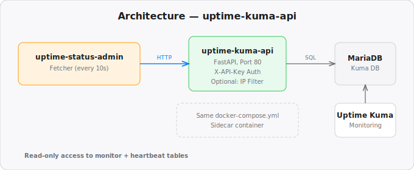

# uptime-kuma-api

Lightweight read-only API proxy for [Uptime Kuma](https://github.com/louislam/uptime-kuma) monitor data. Designed to be deployed as a sidecar container alongside each Uptime Kuma instance. Part of [uptime-kuma-status](https://github.com/wvogel/uptime-kuma-status).

## Architecture



## Quick Start

Add to your Uptime Kuma `docker-compose.yml`:

```yaml
  uptime-kuma-api:
    image: ghcr.io/wvogel/uptime-kuma-api:latest
    restart: unless-stopped
    environment:
      DB_HOST: mariadb        # your MariaDB service name
      DB_NAME: kuma           # database name
      DB_USER: kuma           # database user
      DB_PASS: <password>     # database password
      API_KEY: <your-api-key> # generated by uptime-status admin
    healthcheck:
      test: ["CMD", "curl", "-f", "http://127.0.0.1:80/health"]
      interval: 30s
      retries: 3
      start_period: 10s
      timeout: 5s
    networks:
      - default
      - shared-npm
```

## Environment Variables

| Variable | Default | Description |
|----------|---------|-------------|
| `DB_HOST` | `mariadb` | MariaDB hostname |
| `DB_PORT` | `3306` | MariaDB port |
| `DB_NAME` | `kuma` | Database name |
| `DB_USER` | `kuma` | Database user |
| `DB_PASS` | *required* | Database password |
| `API_KEY` | *required* | API key for authentication |
| `ALLOWED_RANGES` | *(empty)* | Comma-separated CIDR ranges for IP filtering (e.g. `10.0.0.0/8,172.16.0.0/12`) |

## Endpoints

| Endpoint | Auth | Description |
|----------|------|-------------|
| `GET /health` | No | Healthcheck, returns `{"status": "ok"}` |
| `GET /api/monitors` | `X-API-Key` | Returns all monitors + latest heartbeats |

## Security

- API key validated via constant-time comparison (`hmac.compare_digest`)
- Optional IP range filtering via `ALLOWED_RANGES` (CIDR notation)
- `X-Forwarded-For` header respected for IP detection behind reverse proxies
- Read-only database access

## License

MIT
